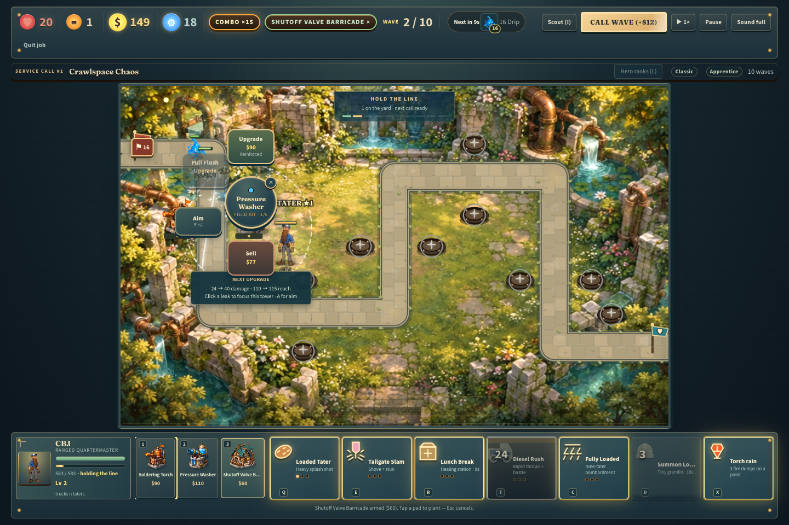
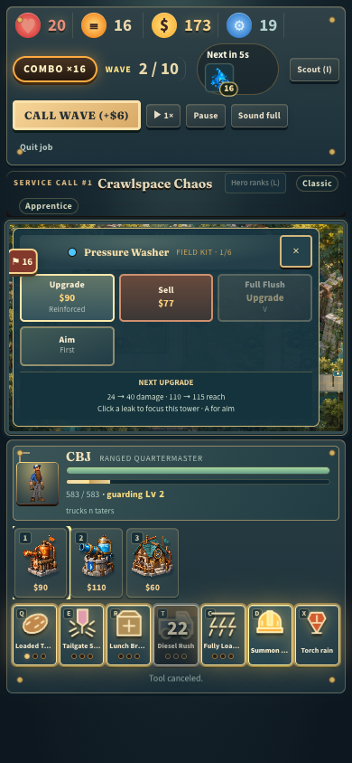

# Gameplay flow audit and overhaul

Audited against `bc36b74494ef6c7f80a415ecc3e305aa58e91bd0`, the merge of PR #7 into current GitHub main. PR #7's delayed hero targeting and invalid boss-fixture training were fixed in `0dd2e4b` before that merge. This branch preserves the visual overhaul, all eight heroes, the requested aura names, and the removal of the three retired towers.

## Findings and changes

| Friction found | Resulting behavior |
| --- | --- |
| Ordinary streak kills, split deaths, and level-ups repeatedly stopped the entire simulation. | Ordinary combat stays continuous. Boss death and breaches retain a small, rate-limited impact pause; interpolation is reset during it. |
| Earning a rank opened a forced modal and temporarily changed combat hotkeys into purchase keys. | Ranks accumulate in a visible button. L opens an optional paused panel. Continue fighting or Esc defers the choice; Q/E/R/T/C cast normally outside it. Keyboard focus stays inside the dialog, and closing preserves a pre-existing manual pause. |
| Pausing inside a 3× frame could allow further fixed updates. | The loop stops immediately and discards accumulated catch-up time. |
| Ground movement during a cast was silently rejected, and heroes accelerated slowly. | The most recent move/attack order executes after the complete cast animation. The HUD acknowledges queued orders; movement starts at 78% speed and brakes over a shorter distance. |
| Injured heroes had little reason to retreat, and melee heroes could pursue flying enemies. | Three seconds without fighting or taking damage starts 4% maximum-health recovery per second. Basic melee targeting stays on the ground; ranged heroes still cover air. |
| Rapid calls could stack unspawned waves; long fights could accumulate an unlimited backlog. | Calls wait for the current group to finish entering. At most two campaign waves remain active, with a six-second breather after the yard clears. Endless remains one wave at a time, with its existing ten-second break. |
| Calling early offered cash without a comparable tactical benefit for hero play. | Calls show and pay their capped cash bonus and recover up to eight seconds from hero, Logan, and torch-rain cooldowns. First call grants no cooldown recovery; Clean Hands still forbids powers. |
| One shared leak counter could misattribute clean rewards when waves overlapped. | Enemies, split children, and boss reinforcements retain their originating wave. Each wave pays once, with separate kills, bounty, leaks, lives lost, and clean status. Endless keeps only 30 recent reports while aggregate totals stay exact. |
| Tower priority was the only way to influence a shot; washers repeatedly selected immune mineral enemies. | Clicking an eligible enemy with a shooter selected focuses it. Ordinary targeting resumes when it leaves range or becomes ineligible. Both focused and ordinary targeting skip immune victims and respect damage already reserved in flight. |
| Placement and upgrading required interpreting only a radius or hover text. | Covered routes light up within relevant attack ranges, upgrade commands show a stat comparison, and tray/build hotkeys use the same order. Short yards use a contained command panel with reachable touch targets. |
| Wave rewards, incoming pressure, and late leaks were hard to read during combat. | A compact battle strip shows phase, alive/queued enemies, progress, early-call and clear receipts, and time-to-breach warnings. Results include clean waves, streaks, and recovered cooldown time. |

No enemy health, wave composition, starting budget, tower cost, or unlock requirement was reduced to obtain a clear. Changes to timing, control, recovery, and targeting do affect difficulty and warrant continued human playtesting.

## Verification

- `npm run build`: TypeScript and production bundle pass.
- `npm test`: **334 tests across 13 files** pass. The 23 added gameplay regressions exercise overlap limits, automatic cadence, independent clean rewards, split ownership, cooldown recovery, cast queues, death/redeployment, retreat healing, all eight heroes' basic target rules, focused shots, immune targets, ordinary impact continuity, and mid-frame pause.
- `git diff --check`: passes.
- Production browser controls: normal resources, actual mouse/keyboard input, no simulation hooks. Repeated-call guard, advertised eight-second recovery, deferred ranks, normal combat keys, queued movement, rank keyboard focus/Space activation, manual pause restoration, build hotkey ordering, upgrade comparison, clear receipts, and 390px command-panel containment all pass without browser exceptions. See [control report](controls.json).
- Production whole-job acceptance: CBJ, Apprentice, all ten Crawlspace waves, **20 lives retained**. Normal purchases, specialization, automatic specialist attack, tower active, explicit hero rank purchases, results, rewards, and reload persistence pass. The isolated profile already contains legitimately earned rewards from preceding tests; resources and unlocks were not injected. See [playthrough report](playthrough.json).
- Responsive UI: all eight hero kits and exact requested aura names checked; Chris's Sand Trap, independent Logan, Scout/manual pause restoration, 390×844 mobile width, 1440×960 desktop bounds, and reduced-motion CSS pass. See [UI report](ui-checks.json).
- Renderer regression: controlled funded fixtures across five environments and eight heroes check byte-identical paused frames, no simulation mutation from drawing, opaque pose blending, six projectile materials, and continuous combat recordings. These are visual fixtures, not campaign balance evidence. See [renderer report](renderer.json). Local timings were captured alongside browser work and are not a hardware performance guarantee.

### Before/after pacing probe

The same `scripts/gameplay-audit.ts` was run against an archived checkout of the merged baseline and this implementation. A controlled probe kills one ordinary drip every six updates for 600 fixed updates (100 kills over 10 seconds of supplied time).

| Measurement | Merged baseline | Gameplay overhaul |
| --- | ---: | ---: |
| Simulation time advanced | 3.567 seconds | 10.000 seconds |
| Updates frozen by impacts | 386 | 0 |
| Greedy-policy campaign clears, 9 maps × 3 difficulties | 3 / 27 | 8 / 27 |
| Campaign runs left unfinished at the harness limit | 0 | 0 |

This measures simulation stalling, **not rendered FPS**. The campaign policy uses legal five-tool kits, seed 7, Jeff, neutral modifiers, and normal money. It is deliberately a fixed greedy builder and is not an estimate of player win rates. Raw results: [before](pacing-before.json), [after](pacing-after.json).

### Active-play campaign check

`scripts/tactical-campaign-check.ts` uses CBJ, seed 7, legal kits, normal money, no gear or perk advantages, ability casts, rank purchases, tower upgrades, specializations, and specialist training. It clears **seven of nine Journeyman maps with 20 lives**. Lift Station loses at wave 10 and Heat Plant at wave 11 under this fixed generic strategy. Both maps expose the strategy's weak route coverage, support placement, and counter-tool choices. Those failures remain recorded in [the campaign report](tactical-campaign.json); they were not hidden or treated as a reason to nerf the enemies.

## Remaining playtesting

The full production-browser victory is the opening map on Apprentice, not all maps/difficulties. Later maps were exercised in simulation. Human playthroughs of Lift Station, Heat Plant, Master difficulty, and long endless sessions with varied heroes/loadouts remain useful for difficulty tuning. This work establishes a substantial control and pacing improvement; it does not establish an award ranking or universal balance.

## Reproduce

```bash
npm test
npm run build
npx vite-node scripts/gameplay-audit.ts /tmp/gameplay-audit.json
npx vite-node scripts/tactical-campaign-check.ts /tmp/tactical-campaign.json journeyman
```

Serve the production build on 127.0.0.1:5177 and development on 127.0.0.1:5176. Open each in an isolated agent-browser profile and pass that profile's CDP HTTP port:

```bash
node scripts/browser-gameplay-check.mjs <production-port> /tmp/controls
node scripts/browser-playtest.mjs <production-port> /tmp/playthrough CBJ
node scripts/browser-ui-check.mjs <production-port> /tmp/ui
node scripts/browser-visual-check.mjs <development-port> /tmp/renderer
```




## PR #8 review follow-up

Greptile's two reporting findings are fixed: streaks now consume completed outcomes in wave-number order, while rewards still arrive immediately; the receipt feed presents every unseen clear, including simultaneous or reverse-order completions, and preserves its display time under early-call notifications. New completions bypass HUD throttling. Four regressions bring the suite to **338 passing tests**.
