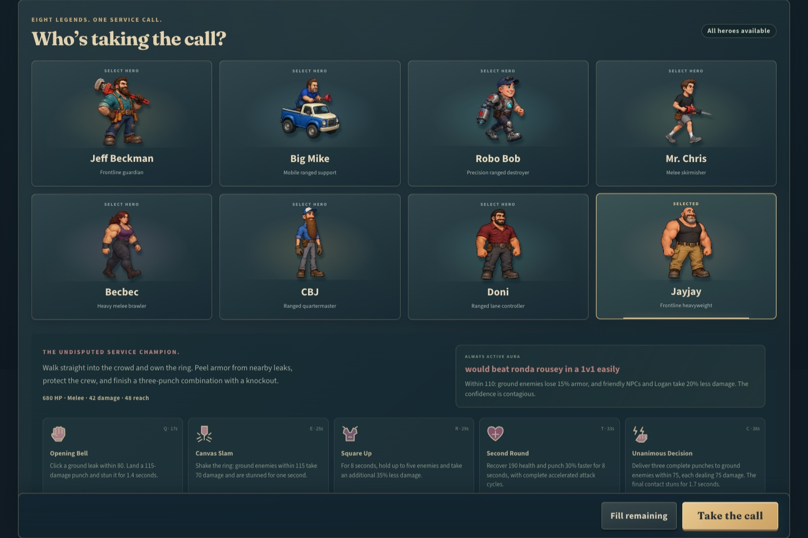
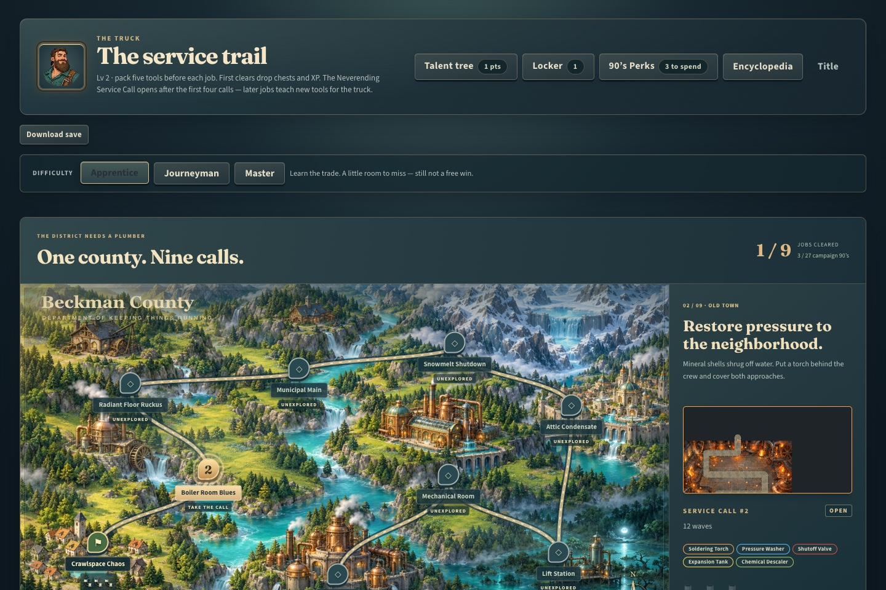
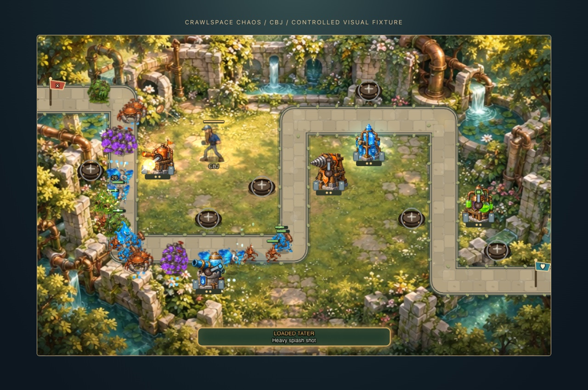
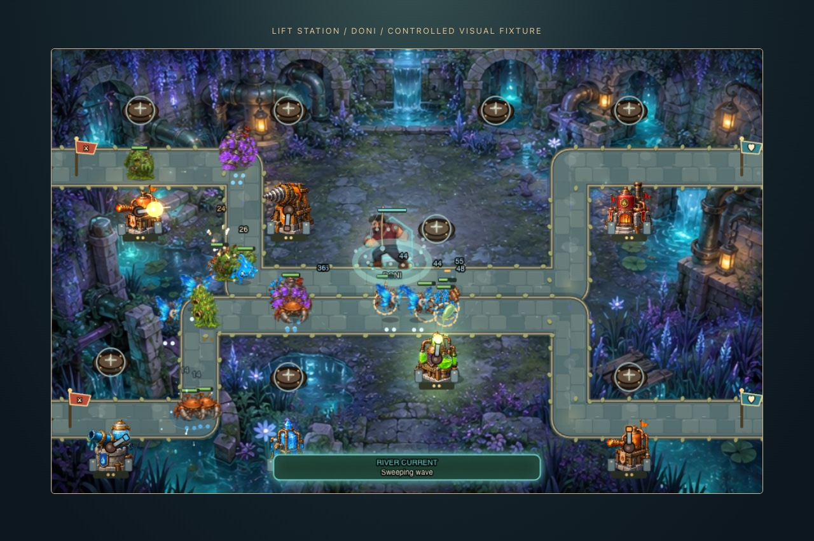
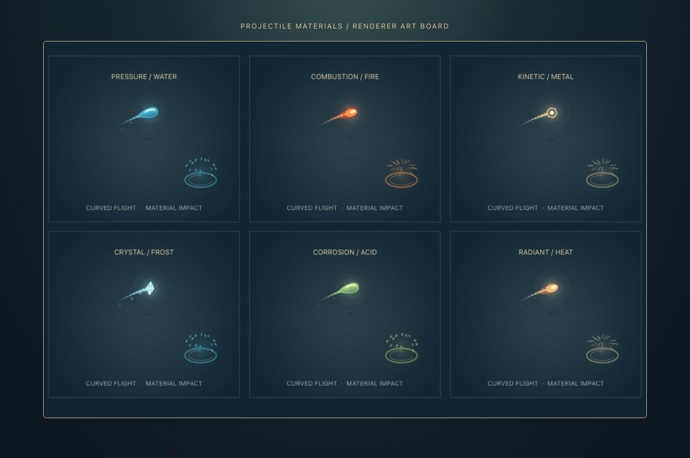
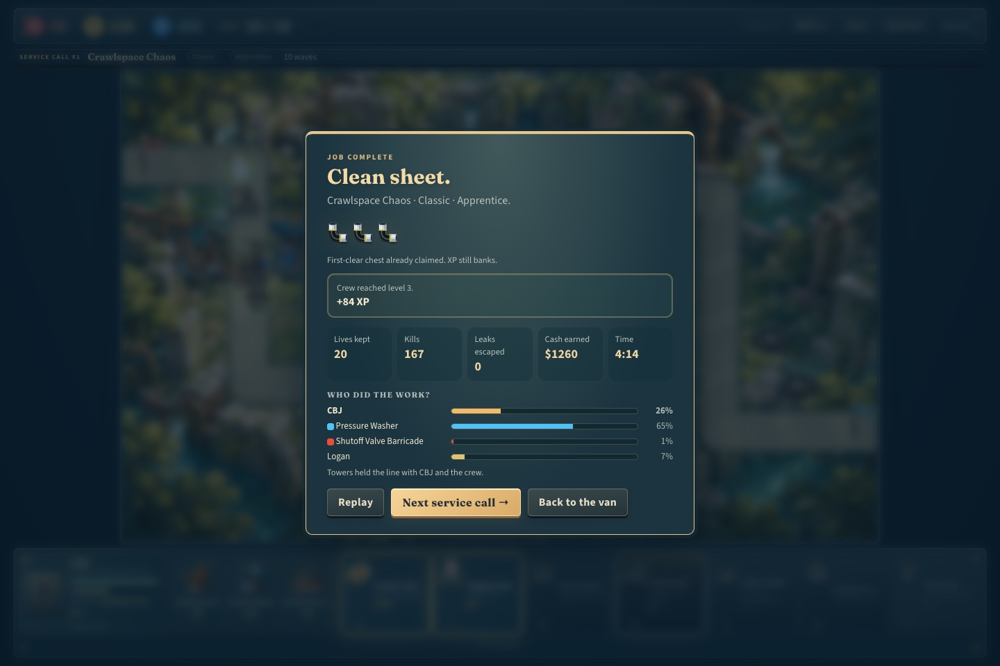
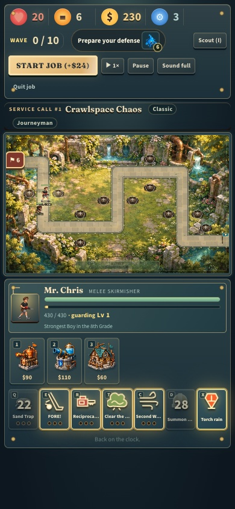

# Cinematic overhaul and eight playable heroes

The branch starts at `4ec3b0c`, the merged PR #6 integration of the latest GitHub/Cursor game. The Scout/manual-pause fix is already on main. This change adds the visual overhaul and promotes CBJ, Doni, and Jayjay into the playable roster.

## Delivered

- Three original painted assets: battlefield environment atlas, title scene, and county campaign map. See [art direction and generation prompts](art-direction.md).
- Coordinated jade, enamel, copper, and brass menus, hero selection, mission previews, combat HUD, build wheels, pause, ranks, and results. Eight-card responsive roster; desktop battlefield and controls fit the viewport.
- Distinct water, fire, heat, metal, frost, and acid projectiles with curved trails, contact light, droplets, fragments, and fading ground marks. Bounded particle/trail caches and map-specific atmosphere.
- Continuous opaque pose blending, complete attack anticipation/contact/recovery, connected enemy deformation, wing motion, and smoother turret facing. Drawing operates on interpolated copies of actors instead of mutating simulation state. Pausing freezes motion and effects; reduced-motion preferences disable decorative menu motion and camera shake.
- CBJ: tater projectiles, splash, supplies, overdrive, bombardment; aura **trucks n taters**.
- Doni: hooked-line attacks, impact-time pulls, fishing nets, healing, river current, ricocheting hooks; aura **guided fishing tour**.
- Jayjay: heavy melee attacks, stun, ground slam, guard, recovery, and a three-contact combo; aura **would beat ronda rousey in a 1v1 easily**.
- Apprentice Workshop, Jayjay’s Stronghold, and CBJ & Doni’s Garage removed from tower catalogues, map pools, specialization kits, build menus, and title counts. There are 24 towers / 48 specializations. Legacy saved tower picks are filtered and legal loadouts refilled while earned progression remains intact. All eight heroes share the existing equipment, mission ranks, talents, Logan summon, and torch-rain systems.

## Verification

`npm run build` passes TypeScript and the Vite production build. `npm test` passes **307 tests across 12 files**. New coverage checks retired saved picks, aura range/expiry/non-stacking, projectile impact timing, boss knockback resistance, flying-target restrictions, distinct ricochet targets, net expiry, three separate combo contacts, defeat/redeploy, all five abilities, and all eight heroes completing the opening map with ordinary resources in the headless harness.

Browser checks use isolated profiles, leaving the owner’s browser save untouched:

| Check | Method |
| --- | --- |
| Mobile + desktop UI | `scripts/browser-ui-check.mjs`: 390×844 and 1440×960; select every hero, inspect five skills and exact new aura names, cast Chris’s Sand Trap and shared Logan, preserve manual pause, verify HUD bounds and reduced-motion CSS |
| New hero controls | `scripts/browser-hero-check.mjs`: production mouse/keyboard input; select, deploy, cast two abilities with each new hero, fight the actual first wave and earn bounty; 20 lives retained for each; retired towers absent from the build tray |
| Whole job | `scripts/browser-playtest.mjs`: ordinary production UI with the selected hero, normal budget, tower purchases/upgrades, specialization, automatic specialist attack, V active, mission ranks, result rewards and reload persistence |
| Renderer | `scripts/browser-visual-check.mjs`: controlled funded fixtures across five maps and all eight heroes; verify opaque blend alpha, byte-identical paused frames, unchanged simulation state, six projectile materials, and continuous recorded combat |

Renderer fixtures deliberately use extra health/money to expose visual states. They are **not** campaign-balance evidence. Performance measurements cover this local Chrome/macOS run; cold mesh construction can cause brief spikes, and these results do not establish performance on other hardware. Full campaign balance on every hero/difficulty remains a playtesting task.

The final production run used **CBJ** on Apprentice: **won, 20/20 lives**, specialist purchased and fired, tower V active used, mission ranks selected, rewards saved and reload verified, with no browser exceptions. The automation counted four direct rank selections; other selections can be made by the combat hotkeys when the rank panel opens. No resources or progression were injected. The isolated save includes rewards earned by earlier test runs.

The final renderer recording ran alongside the production browser test: 546 simulation steps over ten seconds, median render 6.9 ms / p95 10.3 ms with 50 enemies at the end. An earlier isolated warm run reached 599 steps / ten seconds, median 3.0 ms / p95 3.6 ms. Cold first-use frames were slower. The saved report records the final run rather than extrapolating these numbers to all machines.

## Review evidence

- [Production playthrough report](playthrough.json), [new hero controls](hero-controls.json), [responsive UI report](ui-checks.json), [renderer checks](renderer-checks.json).
- [Continuous combat clip](combat-motion.webm) and [CBJ, Doni, Jayjay motion clip](crew-heroes-motion.webm). These are renderer fixtures, captured without audio.

## Reproduce browser checks

Start `npm run dev -- --host 127.0.0.1 --port 5176 --strictPort` and `npm run preview -- --host 127.0.0.1 --port 5177 --strictPort` after building. Open each URL in a separate isolated agent-browser session. Pass its CDP HTTP port and an output directory to the corresponding script. The playthrough accepts an optional fourth argument such as `CBJ`. The renderer script uses the development server; the other scripts use the production preview.
